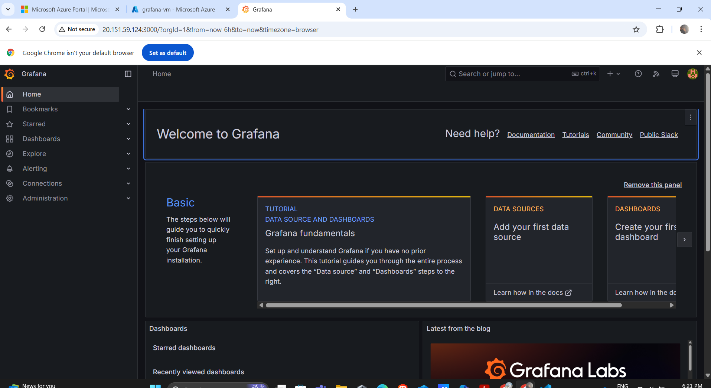
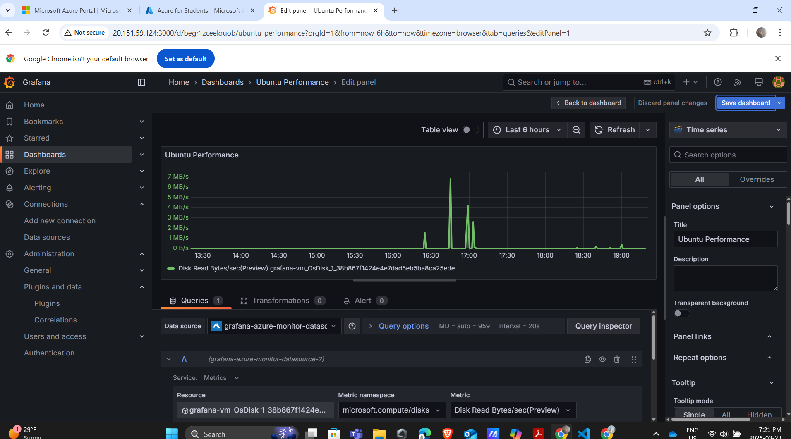

# CST8919 – DevOps: Security and Compliance  
## Lab Report: Grafana Installation and Dashboard for Ubuntu Server Performance  
**Name:** Stefeena Vellachalil Benny 
**Date:** March 23, 2025  

---

## 📘 Objective  
To install and configure Grafana on an Ubuntu server, connect it to Azure Monitor using Managed Identity, and create a dashboard to visualize system performance metrics such as CPU, memory, and network usage.

---

## 🧪 Task 1: Prepare Ubuntu Server

- Created an Azure Ubuntu VM (20.04 LTS).
- Enabled necessary ports: SSH (22) and Grafana (3000).
- Updated system packages:
  ```bash
  sudo apt-get update && sudo apt-get upgrade

## ⚙️ Task 2: Install Grafana

Installed Grafana using the official APT repository:

```bash
sudo apt-get install -y apt-transport-https software-properties-common wget
sudo mkdir -p /etc/apt/keyrings/
wget -q -O - https://apt.grafana.com/gpg.key | gpg --dearmor | sudo tee /etc/apt/keyrings/grafana.gpg > /dev/null
echo "deb [signed-by=/etc/apt/keyrings/grafana.gpg] https://apt.grafana.com stable main" | sudo tee -a /etc/apt/sources.list.d/grafana.list
sudo apt-get update
sudo apt-get install grafana
sudo systemctl daemon-reload
sudo systemctl start grafana-server
sudo systemctl enable grafana-server

sudo systemctl status grafana-server


## 🔐 Task 3: Connect Grafana to Azure Monitor

### ✅ Steps Followed:

1. **Enabled System Assigned Managed Identity** for the Azure VM via the Azure Portal:
   - Navigated to the VM's **Identity** blade
   - Turned **System Assigned** to `On`
   - Clicked **Save**

2. **Assigned Required Roles** to the VM's Managed Identity:
   - `Monitoring Reader` role on **Azure Monitor**
   - `Reader` role on the **Azure Subscription**
   - Done via **Access control (IAM)** in the Azure Portal

3. **Configured Grafana to Use Managed Identity**:
   - Edited the `grafana.ini` file using:
     ```bash
     sudo nano /etc/grafana/grafana.ini
     ```
   - Added or updated the Azure section:
     ```ini
     [azure]
     managed_identity_enabled = true
     ```

4. **Restarted the Grafana Server** to apply the changes:
   ```bash
   sudo systemctl restart grafana-server

## 📊 Task 4: Create a Dashboard in Grafana

### ✅ Steps Followed:

1. **Opened the Grafana Dashboard Creator**:
   - Clicked on the **“+” icon** in the left sidebar
   - Selected **“Dashboard”**
   - Clicked **“Add new panel”**

2. **Selected Azure Monitor as the Data Source**:
   - In the **Panel Editor**, selected `Azure Monitor` from the data source dropdown

3. **Configured the Query to Display CPU Usage**:
   - **Subscription:** Selected the correct Azure subscription
   - **Resource Group:** Selected the resource group containing the VM
   - **Resource Type:** Virtual Machines
   - **Resource:** The name of the Grafana VM
   - **Metric Namespace:** `Insights.Metrics`
   - **Metric:** `Percentage CPU`
   - **Aggregation:** `Average`

4. **Customized the Panel**:
   - Panel Title: `CPU Usage`
   - Visualization Type: `Time Series`
   - Set colors and thresholds for better readability

5. **Saved the Panel and the Dashboard**:
   - Clicked **“Apply”** to save the panel
   - Clicked **“Save dashboard”** and named it `Ubuntu Performance Dashboard`

---

### 🔽 Screenshot Examples:

- 
- 
- 

---

### 📝 Notes:
- This dashboard provides a real-time view of CPU performance of the Ubuntu VM using Azure Monitor metrics.
- More panels (e.g., memory usage, network traffic) can be added using the same method for comprehensive monitoring.

## ✅ Step 5: Verify and Finalize the Dashboard

### 🎯 Objective:
To confirm that the Grafana dashboard is correctly displaying performance metrics (like CPU usage) pulled from Azure Monitor using Managed Identity.

---

### 🔍 Actions Performed:

1. **Opened Grafana in the browser**:
   ```text
   http://<vm-public-ip>:3000

   ## 📦 Step 6: Final Deliverables and Submission

### 🗂️ Deliverables Compiled:

1. **Grafana Dashboard**  
   - A fully functional dashboard displaying real-time performance metrics from the Ubuntu VM using Azure Monitor.
   - Includes at least one panel (e.g., CPU Usage) based on real Azure data.
   - Data is pulled securely using **Azure Managed Identity**.

